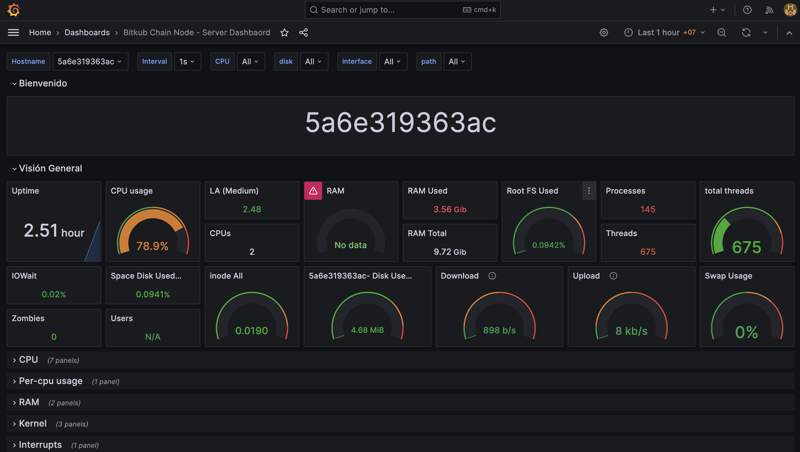
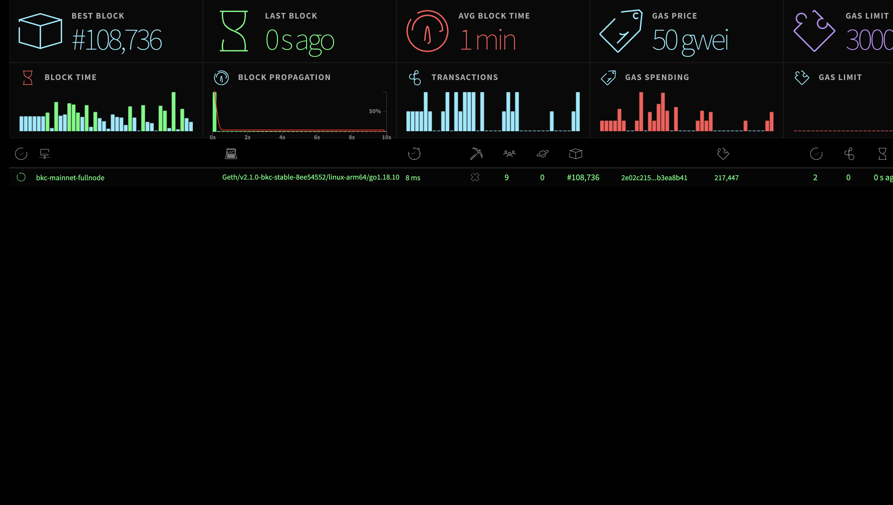

# Bitkub Chain (PoS) main Network
Easy run Bitkub Chain Node






### Clone
```bash
$ git clone https://github.com/bitkub-chain/bkc-node-docker.git
$ cd bkc-node-docker/mainnet
```

### Running a Validator
```bash
# Run 
$ docker compose -f docker-compose.validator.yaml up -d
```


### Running a Fullnode
```bash
# Run 
$ docker compose -f docker-compose.fullnode.yaml up -d
```

### Running a Archivenode
```bash
# Run 
$ docker compose -f docker-compose.archivenode.yaml up -d
```

### Grafana Dashboard
- http://localhost:8080
```
username: admin
password: admin
```

### Stats Dashboard
- http://localhost:8090